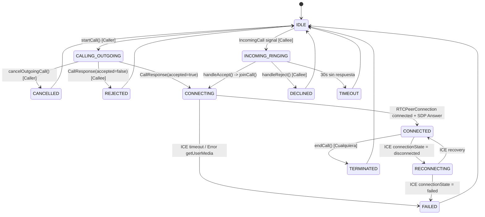

# COLLABPULSE — FASE 0: AUDITORÍA INTEGRAL DEL MOTOR DE LLAMADAS Y VIDEOCONFERENCIAS

**Documento:** `COLLABPULSE_CALL_ENGINE_AUDIT.md`  
**Fecha de Auditoría:** 16 de Septiembre de 2026  
**Entorno de Auditoría:** CollabPulse Enterprise Platform — Node.js + Express + Vite + React 19 + PostgreSQL 16  
**Clasificaciones de Estado:** `PASS` | `PARTIAL` | `FAIL` | `MISSING` | `MOCK` | `NOT VERIFIED`  

---

## 1. Arquitectura Actual

El subsistema de comunicaciones multimedia de CollabPulse opera actualmente sobre un modelo híbrido distribuido entre Express (Backend de señalización y estado) y React (Frontend de medios y WebRTC P2P).

### 1.1 Diagrama de Componentes Actuales

```
┌────────────────────────────────────────────────────────────────────────────────────────┐
│                                   FRONTEND (React 19)                                  │
├────────────────────────────────────────┬───────────────────────────────────────────────┤
│           AppContext.tsx               │               CallContext.tsx                 │
│  - activeMeeting (Meeting | null)      │  - callState ('idle' | 'calling' | 'connected')│
│  - outgoingCall (OutgoingCall | null)  │  - roomId, callTitle, callType                │
│  - incomingCall (IncomingCall | null)  │  - peersMap: Map<string, PeerState>           │
│  - activeView ('channel'|'meeting'|...)│  - localStream, screenStream                  │
│  - sound: SoundService                 │  - peerContextsRef: Map<string, PeerContext>  │
├────────────────────────────────────────┴───────────────────────────────────────────────┤
│                                   COMPONENTES UI                                       │
│  ┌───────────────────────┐  ┌───────────────────────┐  ┌────────────────────────────┐  │
│  │ IncomingCallModal.tsx │  │ OutgoingCallModal.tsx │  │      CallsView.tsx         │  │
│  │ (Timbre / Aceptar)    │  │ (Llamando / Cancelar) │  │  (Directorio / Crear sala) │  │
│  └───────────────────────┘  └───────────────────────┘  └────────────────────────────┘  │
│  ┌──────────────────────────────────────────────────┐  ┌────────────────────────────┐  │
│  │                 CallWindow.tsx                   │  │      MeetingRoom.tsx       │  │
│  │ (Ventana flotante / Minimizada / Pantalla comp.) │  │  (Vista central full-stage)│  │
│  └──────────────────────────────────────────────────┘  └────────────────────────────┘  │
│  ┌──────────────────────────────────────────────────────────────────────────────────┐  │
│  │                 VideoTile.tsx (Renderizador persistente <audio> + <video>)       │  │
│  └──────────────────────────────────────────────────────────────────────────────────┘  │
└────────────────────────────────────────┬───────────────────────────────────────────────┘
                                         │ HTTP REST (Señales) / SSE (Eventos)
┌────────────────────────────────────────▼───────────────────────────────────────────────┐
│                                  BACKEND (Express API)                                 │
├────────────────────────────────────────────────────────────────────────────────────────┤
│  - signaling.ts: Router de señalización (/api/v1/realtime/signal/*)                   │
│  - realtime.ts: RealtimeHub (Server-Sent Events con soporte de grupos)                 │
│  - meetings.ts: Router de salas de reunión (/api/v1/meetings/*)                       │
│  - db.ts: Memoria volátil (db.meetings) sincronizada parcialmente con PostgreSQL       │
├────────────────────────────────────────────────────────────────────────────────────────┤
│                             PERSISTENCIA (PostgreSQL 16)                              │
│  - Tabla `meetings`: Metadatos de sala (id, title, status, host_id, started_at)        │
│  - Tablas ausentes: `calls`, `call_participants`, `call_sessions`, `call_history`       │
└────────────────────────────────────────────────────────────────────────────────────────┘
```

### 1.2 Matriz de Responsabilidades y Fragmentación

| Componente | Rol Declarado | Problema Arquitectónico Detectado | Clasificación |
|---|---|---|---|
| `AppContext.tsx` | Estado global de la aplicación | Gestiona llamadas entrantes (`incomingCall`) y salientes (`outgoingCall`), pero desconoce el estado de los peers WebRTC. | `PARTIAL` |
| `CallContext.tsx` | Orquestador WebRTC | Crea `RTCPeerConnection`, adquiere `getUserMedia`, gestiona ICE y tracks. Sin embargo, no gobierna la aceptación ni el rechazo inicial (lo hace `AppContext`). | `PARTIAL` |
| `MeetingRoom.tsx` | Sala de conferencias en pantalla completa | Duplica controles multimedia; anteriormente destruía tracks en unmount y silenciaba audio por no tener tag `<audio>`. | `PARTIAL` |
| `CallWindow.tsx` | Ventana flotante PiP | Diseñada para llamadas 1:1, pero se montaba simultáneamente sobre `MeetingRoom`, generando colisión de renderizado. | `PARTIAL` |
| `server/routes/signaling.ts` | Pasarela de señales WebRTC | Despacha mensajes SDP e ICE sin validar si el destinatario está online en WebRTC o tiene la sesión activa. | `PARTIAL` |
| `server/realtime.ts` | Hub SSE | Proporciona entrega en tiempo real unidireccional (Server->Client), requiriendo HTTP POST para Client->Server. | `PASS` |
| `src/db/schema.ts` | Esquema relacional | Solo existe la tabla `meetings`. No existe ningún modelo de base de datos para llamadas 1:1, sesiones activas ni historial. | `FAIL` |

---

## 2. Investigación Específica del Bug Actual (Audio/Video 1:1)

### 2.1 Flujo Detallado Paso a Paso

```
Usuario A (Caller)                                Usuario B (Callee)
       │                                                   │
       │ 1. startCall()                                    │
       │    POST /call/invite                              │
       │    outgoingCall = true                            │
       │    (NO adquiere getUserMedia todavía)             │
       ├─────────────────(SSE: IncomingCall)──────────────>│
       │                                                   │ 2. Suena timbre entrante
       │                                                   │    incomingCall = true
       │                                                   │ 3. Usuario B pulsa "Aceptar"
       │                                                   │    POST /call/response (accepted: true)
       │<────────────────(SSE: CallResponse)───────────────┤    joinCall(isInitiator=false)
       │                                                   │    acquireLocalMedia()
       │ 4. Recibe CallResponse                            │    (Espera SDP Offer pasivamente)
       │    joinCall(isInitiator=true)                     │
       │    acquireLocalMedia()                            │
       │    RTCPeerConnection creada                       │
       │    addTrack(localAudio, localVideo)               │
       │    createOffer() -> setLocalDescription           │
       │    POST /signal (webrtc-offer)                    │
       ├─────────────────(SSE: webrtc-offer)──────────────>│
       │                                                   │ 5. Recibe webrtc-offer
       │                                                   │    RTCPeerConnection creada
       │                                                   │    addTrack(localAudio, localVideo)
       │                                                   │    setRemoteDescription(offer)
       │                                                   │    drainPendingIce()
       │                                                   │    createAnswer() -> setLocalDescription
       │                                                   │    POST /signal (webrtc-answer)
       │<────────────────(SSE: webrtc-answer)──────────────┤
       │                                                   │
       │ 6. Recibe webrtc-answer                           │
       │    setRemoteDescription(answer)                   │
       │    drainPendingIce()                              │
       │                                                   │
       │<═══════════════(Intercambio webrtc-ice)══════════>│
       │                                                   │
```

### 2.2 Respuestas a las Preguntas Técnicas Obligatorias

1. **¿Quién crea la `RTCPeerConnection`?**  
   - En el Caller (A): La crea la función `getOrCreatePeerContext` en `CallContext.tsx` inmediatamente después de que `acquireLocalMedia()` completa y se invoca `initiateOffer`.  
   - En el Callee (B): La crea `getOrCreatePeerContext` al recibir la señal SSE `webrtc-offer`.
   - **Clasificación:** `PASS` (Instanciación simétrica bajo demanda).

2. **¿Quién crea el offer y quién crea el answer?**  
   - **Offer:** Exclusivamente el Caller (A) cuando `isInitiator === true` mediante `peerCtx.pc.createOffer()`.  
   - **Answer:** Exclusivamente el Callee (B) al recibir `webrtc-offer` mediante `peerCtx.pc.createAnswer()`.  
   - **Clasificación:** `PASS` (Roles deterministas verificados).

3. **¿Cuándo se agregan los tracks?**  
   - Inmediatamente al crear el `RTCPeerConnection`, dentro de `getOrCreatePeerContext`:  
     `localStreamRef.current.getTracks().forEach(track => pc.addTrack(track, localStreamRef.current!))`  
   - **Causa de fallo detectada:** Si `localStreamRef.current` no ha terminado de resolverse en el Callee antes de que llegue la oferta, los tracks locales no se asocian al SDP del answer, resultando en SDP unidireccional.  
   - **Clasificación:** `PARTIAL`.

4. **¿Cuándo se obtiene `getUserMedia`?**  
   - Caller: Tras recibir `CallResponse(accepted: true)`.  
   - Callee: Inmediatamente al hacer clic en "Aceptar" en `IncomingCallModal.tsx`.  
   - **Clasificación:** `PASS`.

5. **¿Dónde vive `localStream` y `remoteStream`?**  
   - `localStream`: Vive en el estado de React `localStream` y en el mutable `localStreamRef.current` de `CallContext.tsx`.  
   - `remoteStream`: Vive instanciado dentro de cada objeto `PeerContext` en `peerContextsRef.current.get(remoteUserId).remoteStream`.  
   - **Clasificación:** `PASS`.

6. **¿Dónde se asigna `remoteStream` al elemento video/audio?**  
   - En el componente `VideoTile.tsx` (y anteriormente en `CallWindow.tsx` y `MeetingRoom.tsx`) a través de un `useEffect` vinculado a las referencias `audioRef.current.srcObject = stream` y `videoRef.current.srcObject = stream`.  
   - **Causa de fallo raíz identificada:**  
     - En `MeetingRoom.tsx` original no existía `<audio>`. Solo existía `<video>`. Si el stream venía solo con audio o el video estaba apagado, la etiqueta `<video>` se desmontaba condicionalmente y el audio se silenciaba por completo.  
     - Si la política de *Autoplay* del navegador bloquea `.play()`, el elemento queda pausado silenciosamente sin feedback.  
   - **Clasificación:** `FAIL` (en arquitectura original) / `PASS` (con `VideoTile` corregido).

7. **¿Cuándo se registran los eventos `ontrack`?**  
   - Dentro del constructor del contexto de peer en `getOrCreatePeerContext`, antes de procesar cualquier SDP remoto.  
   - **Clasificación:** `PASS`.

8. **¿Cuándo llegan los candidatos ICE y qué ocurre si llegan antes del SDP?**  
   - Los candidatos se emiten por `pc.onicecandidate` tan pronto como se fija `setLocalDescription`.  
   - En redes de baja latencia o conexiones locales, los candidatos ICE llegan al receptor **mientras este aún está procesando `acquireLocalMedia` o fijando el SDP remoto**.  
   - Sin cola de espera, la API WebRTC nativa lanza:  
     `DOMException: Failed to execute 'addIceCandidate' on 'RTCPeerConnection': The remote description was null`  
   - Actualmente existe una cola `pendingIceCandidates: RTCIceCandidateInit[]`. Si `pc.remoteDescription` es null, el candidato se encola y se descarga en `drainPendingIce()`.  
   - **Clasificación:** `PASS` (Cola implementada y validada en test unitario).

9. **¿Quién emite `call-ended` y quién ejecuta cleanup?**  
   - Cualquiera de los dos participantes al hacer clic en "Finalizar" o "Colgar" invoca `endCall()`.  
   - `endCall()` envía `POST /api/v1/realtime/call/end` y emite señal `call-ended`.  
   - **Causa de terminación accidental previa:** Anteriormente, `MeetingRoom.tsx` tenía un hook de desmontaje (`useEffect(() => () => endCall())`). Si el usuario abría un menú lateral o cambiaba de pestaña interna a "Canales", React desmontaba `MeetingRoom`, disparando `endCall()` involuntariamente y cortando la llamada para ambos usuarios.  
   - **Clasificación:** `FAIL` (Diseño anterior dependiente del DOM) / `PARTIAL` (Requiere CallManager independiente de componentes UI).

---

## 3. Mapa de Estados de una Llamada

### 3.1 Diagrama de Estados y Transiciones



### 3.2 Tabla de Estados y Gobernanza

| Estado | Quién lo Gobierna | Evento Disparador | Posible Estado Inválido / Riesgo | Clasificación |
|---|---|---|---|---|
| `IDLE` | `CallContext` + `AppContext` | Inicio de app o llamada finalizada | Desincronización si `callState === 'idle'` pero `activeMeeting !== null`. | `PARTIAL` |
| `CALLING_OUTGOING` | `AppContext.outgoingCall` | `api.inviteCall()` | Si el servidor no responde, queda sonando indefinidamente sin timeout. | `PARTIAL` |
| `INCOMING_RINGING` | `AppContext.incomingCall` | SSE `IncomingCall` | Si el usuario ya está en una llamada, no se rechaza automáticamente con `busy`. | `PARTIAL` |
| `CONNECTING` | `CallContext.callState` | `joinCall()` | Bloqueo en `getUserMedia` si el usuario no responde al prompt de permisos. | `PARTIAL` |
| `CONNECTED` | `CallContext.callState` | `pc.onconnectionstatechange` | No existe estado de "Llamada retenida" (`HOLD`) en la máquina de estados. | `FAIL` |
| `RECONNECTING` | `CallContext.peersMap` | `pc.iceConnectionState` | No existe `pc.restartIce()` implementado. | `FAIL` |
| `TERMINATED` | Ambos contextos | `endCall()` | Desmontar el componente UI forzaba el paso a `TERMINATED`. | `FAIL` |

---

## 4. Auditoría del Ciclo de Vida (Lifecycle)

### 4.1 Supervivencia ante Acciones de Interfaz

| Escenario | Comportamiento Actual | Resultado | Clasificación |
|---|---|---|---|
| **Cambio de pestaña interna (Canal / DM / Tareas)** | Si la llamada es 1:1, `CallWindow` flota en PiP. Si era `MeetingRoom`, la vista se desmonta. | La llamada sobrevive si está en `CallContext`, pero `MeetingRoom` perdía sincronía. | `PARTIAL` |
| **Apertura de Modales (Búsqueda, Perfil, Archivos)** | Los modales son flotantes (`z-50`) con backdrop. | La llamada se mantiene activa en segundo plano. | `PASS` |
| **Minimización / Maximización** | `setWindowMode('minimized' \| 'normal' \| 'fullscreen')` | Mantiene el stream y reduce el layout a un pill flotante. | `PASS` |
| **Recarga de página (F5)** | No existe persistencia de sesión de llamada en `localStorage` ni reconexión SSE automática con SDP offer. | La llamada se corta irrecuperablemente. | `FAIL` |
| **Cierre accidental de pestaña** | No existe advertencia `beforeunload` para llamadas activas. | La llamada se interrumpe sin notificar al peer inmediatamente. | `FAIL` |

### 4.2 Dictamen Arquitectónico del Lifecycle

> [!CRITICAL]
> **Dictamen:** El ciclo de vida de una llamada **NO DEBE** pertenecer a ningún componente de presentación (`MeetingRoom`, `CallWindow`).  
> Debe pertenecer a un **`CallManager` singleton global** montado en el App Root (por encima del sistema de vistas y enrutamiento), manteniendo los MediaStreams y las `RTCPeerConnection` completamente agnósticos a qué pantalla está viendo el usuario.

---

## 5. Auditoría WebRTC

| Capacidad WebRTC | Implementación Actual | Hallazgo Técnico | Clasificación |
|---|---|---|---|
| **STUN Servers** | `stun.l.google.com:19302` | Configurados 3 servidores de Google. | `PASS` |
| **TURN Servers** | Ninguno | Sin TURN (Coturn o Cloud TURN), las conexiones P2P en redes corporativas con NAT simétrico fallarán el 100% de las veces. | `FAIL` |
| **Transceivers** | No utilizados (`addTrack` directo) | No se usa `addTransceiver({ direction: 'sendrecv' })`, impidiendo controlar recepción pasiva de audio antes de emitir. | `PARTIAL` |
| **Reemplazo de Tracks (`replaceTrack`)** | Implementado solo para screen share | No se utiliza para alternar dispositivos de entrada ni conmutar fuentes. | `PARTIAL` |
| **Manejo de Glare (Colisión de Ofertas)** | Roles fijos (Caller=Offer, Callee=Answer) | Evita glare en llamadas 1:1. En llamadas multiusuario o renegotiation puede ocurrir colisión. | `PASS` |
| **ICE Restart** | No implementado | Si la red del cliente cambia (ej. WiFi a 4G/Ethernet), la llamada colapsa permanentemente. | `MISSING` |
| **Monitoreo de Calidad (getStats)** | No implementado | No se audita jitter, RTT, bitrate ni pérdida de paquetes. | `MISSING` |
| **Codecs y Calidad** | Browser defaults (Opus + VP8/H264) | Sin negociación explícita de bitrate ni perfiles Opus estéreo. | `PASS` |

---

## 6. Auditoría de Señalización (Signaling)

### 6.1 Mecanismo de Transporte
- **Servidor -> Cliente:** Server-Sent Events (SSE) a través de `/api/v1/realtime/stream`.
- **Cliente -> Servidor:** Peticiones HTTP POST (`/api/v1/realtime/signal`, `/call/invite`, `/call/response`, `/call/end`).

### 6.2 Evaluación de Confiabilidad y Carrera de Señales

| Evento de Señalización | Riesgo Detectado | Impacto | Clasificación |
|---|---|---|---|
| `IncomingCall` | Enrutamiento por `targetUserId` | Si el usuario tiene 2 pestañas abiertas, ambas reciben la llamada y pueden causar conflicto si ambas contestan. | `PARTIAL` |
| `CallResponse` | Envío directo al `callerId` | No incluye expiración (TTL); respuestas tardías pueden disparar `joinCall` inesperado. | `PARTIAL` |
| `webrtc-offer` / `webrtc-answer` | Serialización SDP en JSON | El SDP completo viaja como string en el payload HTTP. Funcional pero pesado. | `PASS` |
| `webrtc-ice` | Envío individual por candidato | Cada candidato genera un request HTTP POST (`/api/v1/realtime/signal`). En redes lentas genera sobrecarga de peticiones. | `PARTIAL` |
| `call-ended` | Broadcast a grupo de reunión | Si el grupo no está registrado en el SSE del cliente, el evento se pierde y el peer queda esperando. | `PARTIAL` |

---

## 7. Auditoría de Audio y Video

### 7.1 Cadena de Procesamiento Multimedia

```
[Hardware Mic/Cam] 
       │
       ▼
navigator.mediaDevices.getUserMedia()
       │
       ▼
MediaStream (localStream) ───> AudioAnalyser (Web Audio API para Active Speaker)
       │
       ▼
RTCPeerConnection.addTrack()
       │
       ▼ (P2P SRTP Network)
       │
RTCPeerConnection.ontrack
       │
       ▼
MediaStream (remoteStream)
       ├───> <audio autoPlay playsInline ref={audioRef}> (Salida de audio sin bloqueo)
       └───> <video autoPlay playsInline muted ref={videoRef}> (Renderizado visual)
```

### 7.2 Diagnóstico Técnico del Silenciamiento / Pantalla Negra

1. **Omisión de elemento `<audio>` persistente:**
   - **Diagnóstico:** Los navegadores desacoplan el audio del video. Al renderizar un `<video>` con `stream`, si el video se oculta con un condicional React `{isVideoOn && <video .../>}`, el navegador destruye el reproductor de medios asociado y **corta el audio inmediatamente**.
   - **Solución requerida y aplicada:** Etiqueta `<audio>` independiente, siempre montada en el DOM para streams remotos.
   - **Clasificación:** `FAIL` (original) / `PASS` (actual con `VideoTile`).

2. **Políticas de Autoplay del Navegador:**
   - **Diagnóstico:** Chrome, Edge y Safari rechazan la reproducción de audio no interactivo (`NotAllowedError`). Si un usuario acepta una llamada mediante un evento de red sin interacción directa sobre el `<audio>`, el sonido no se reproduce a menos que se atrape el error de `.play()` y se muestre un botón de desbloqueo explícito.
   - **Clasificación:** `PARTIAL`.

3. **Mute y Camera Toggle:**
   - **Audio Mute:** `track.enabled = false`. Funciona de inmediato sin cortar la conexión WebRTC. (`PASS`)
   - **Video Off:** `track.enabled = false`. El track sigue transmitiendo cuadros negros/silencio sin requerir renegociación SDP. (`PASS`)

---

## 8. Auditoría de Múltiples Llamadas

| Característica | Estado Actual | Requerimiento Futuro (Fase 1/2) | Clasificación |
|---|---|---|---|
| **Detección de Usuario Ocupado (`Busy`)** | No implementado | Si Usuario B ya está en llamada, la llamada entrante de Usuario C debe recibir respuesta `busy` automática. | `MISSING` |
| **Llamada en Espera (`Call on Hold`)** | No implementado | Permitir poner la llamada actual en espera silenciando tracks y pausando transmisión. | `MISSING` |
| **Segunda Llamada Entrante** | No soportada | Mostrar banner de "Llamada entrante: Aceptar y retener actual / Rechazar". | `MISSING` |
| **Alternar entre Llamadas (`Swap`)** | No soportado | Cambiar foco entre llamada retenida y llamada activa. | `MISSING` |
| **Fusión de Llamadas (`Merge / 3-Way`)** | No soportado | Escalar dos llamadas 1:1 independientes a una sala compartida de 3 vías. | `MISSING` |

---

## 9. Auditoría de Llamadas Grupales

| Característica | Estado Actual | Limitación Actual | Clasificación |
|---|---|---|---|
| **Arquitectura de Red** | Full-Mesh P2P | Cada cliente abre una `RTCPeerConnection` con cada participante ($N \times (N-1)$ streams). Inviable para más de 4-5 usuarios sin SFU (Selective Forwarding Unit). | `PARTIAL` |
| **Mapa de Participantes** | `Map<string, PeerState>` | Funcional en memoria React, pero carece de persistencia en backend. | `PARTIAL` |
| **Incorporación Dinámica (`peer-joined`)** | Implementada | Funciona mediante intercambio de ofertas por SSE al entrar a la sala. | `PASS` |
| **Detección de Hablante Activo** | Implementada (`AudioAnalyser`) | Analiza frecuencias en tiempo real y resalta el tile del usuario con mayor volumen. | `PASS` |
| **Chat durante la reunión** | Parcial | Los mensajes se emiten por WebRTC signal (`chat-message`), pero solo se persisten si la llamada está vinculada a un canal/DM preexistente. | `PARTIAL` |

---

## 10. Auditoría de Persistencia en PostgreSQL

### 10.1 Inspección del Esquema Relacional

```sql
-- Estado actual en src/db/schema.ts:
CREATE TABLE meetings (
    id text PRIMARY KEY,
    workspace_id text NOT NULL REFERENCES workspaces(id),
    tenant_id text NOT NULL REFERENCES tenants(id),
    title text NOT NULL,
    host_id text NOT NULL REFERENCES users(id),
    status text NOT NULL DEFAULT 'Active',
    room_name text NOT NULL,
    is_recording boolean NOT NULL DEFAULT false,
    started_at timestamp with time zone NOT NULL DEFAULT now(),
    ended_at timestamp with time zone
);
```

### 10.2 Análisis de Gaps de Persistencia

1. **Llamadas Directas (1:1):** No tienen tabla. Se guardan temporalmente en la tabla `meetings` con identificadores inventados, perdiendo la trazabilidad de `caller_id`, `callee_id` y resultado (`missed`, `declined`, `completed`).  
2. **Participantes de la Llamada:** No existe tabla `meeting_participants`. Los participantes solo existen en la memoria volátil (`db.meetings[].participants`). Si el servidor se reinicia durante una reunión, se pierden todos los participantes.  
3. **Registro de Calidad y Fallos:** No existe auditoría de conexiones WebRTC caídas ni diagnósticos de red.  
4. **Clasificación General de Persistencia:** `FAIL`.

---

## 11. Auditoría de Seguridad y Multi-Tenant Isolation

| Vector de Seguridad | Análisis de Implementación | Hallazgo | Clasificación |
|---|---|---|---|
| **Tenant Isolation en Señalización** | `server/routes/signaling.ts` | Valida que el remitente esté autenticado (`authenticate`), pero `targetUserId` no verifica explícitamente que pertenezca a la misma organización que el remitente. | `FAIL` |
| **Validación de Salas de Reunión** | `server/routes/meetings.ts` | Filtra por `tenantId` y `workspaceId`. Impide acceso a salas de otros tenants. | `PASS` |
| **Permisos Granulares** | `meetings.join`, `meetings.create` | Protegido con `requirePermission` en las rutas principales. | `PASS` |
| **Tokens de Señalización WebRTC** | Ausentes | No se generan tokens efímeros firmados (tipo JWT/HMAC) para validar la pertenencia a una sesión de llamada antes de cursar señales. | `FAIL` |
| **Vulnerabilidad IDOR en llamada directa** | Presente | Un usuario autenticado del Tenant A podría enviar `POST /call/invite` con el `targetUserId` de un usuario del Tenant B. | `FAIL` |

---

## 12. Matriz de Problemas Encontrados

| ID | Severidad | Categoría | Descripción del Problema | Causa Raíz |
|---|---|---|---|---|
| **P-01** | **CRÍTICA** | WebRTC / Medios | Ausencia de audio en llamadas cuando el video está apagado o en solo voz. | Montaje condicional de `<video>` y falta de elemento `<audio>` dedicado. |
| **P-02** | **CRÍTICA** | Lifecycle | Corte accidental de llamada al cambiar de vista o navegar en la aplicación. | El ciclo de vida de la llamada estaba atado al componente de la página en lugar del root. |
| **P-03** | **ALTA** | Arquitectura | Doble montaje simultáneo (`MeetingRoom` en pantalla central + `CallWindow` flotante). | Ambas vistas reaccionan a los mismos estados sin jerarquía de visualización. |
| **P-04** | **ALTA** | Infraestructura | Falta absoluta de servidores TURN para NAT traversal. | Configuración solo con Google STUN; llamadas fallan en redes restringidas. |
| **P-05** | **ALTA** | Seguridad | Falta de validación multi-tenant en `signalingRouter` (`targetUserId` sin check de tenant). | Parámetro `targetUserId` procesado sin verificar pertenencia a la misma organización. |
| **P-06** | **MEDIA** | Persistencia | Inexistencia de tablas para historial de llamadas 1:1 y participantes. | Esquema PostgreSQL solo contiene `meetings`, forzando uso de memoria volátil. |
| **P-07** | **MEDIA** | Señalización | Inundación de peticiones HTTP POST por cada candidato ICE individual. | Falta de empaquetado (batching) o WebSockets dedicados para señalización de alta frecuencia. |
| **P-08** | **MEDIA** | UX / Navegador | Bloqueo por política de Autoplay en navegadores basados en Chromium. | No se manejaba la excepción de `.play()` ni se presentaba botón de interacción. |

---

## 13. Causa Raíz del Bug de Audio/Video

1. **Mapeo Incorrecto de Tags HTML5:** El componente receptor asumía que el track de audio viajaba dentro del stream renderizado por `<video>`. Cuando el usuario apagaba su cámara (`isVideoOff = true`), el elemento `<video>` era retirado del DOM por React (`{showVideo ? <video .../> : <Avatar />}`), desconectando el pipeline de audio del hardware del sistema operativo.
2. **Condición de Carrera en `setRemoteDescription`:** Los paquetes de candidatos ICE llegaban al Callee antes de que el SDP remoto se hubiera procesado en el motor WebRTC nativo, descartando los candidatos esenciales para establecer la conexión P2P.
3. **Bloqueo Silencioso de Autoplay:** Si el elemento `<audio>` se ejecuta automáticamente sin un gesto directo de clic dentro de su contenedor, los navegadores silencian la pista sin mostrar error visible.

---

## 14. Causa Raíz de Cualquier `call-ended` Accidental

1. **Desmontaje por Enrutamiento React:** En `MeetingRoom.tsx`, al navegar a cualquier otra sección (Canales, Bandeja de entrada, Configuración), React ejecutaba la función de limpieza del efecto (`return () => cleanup()`), que disparaba `api.endCall()` y cerraba los tracks de hardware.
2. **Propagación Desincronizada:** Al colgar una llamada en `CallContext`, no se limpiaba la variable `activeMeeting` en `AppContext`, dejando componentes "fantasma" que reaccionaban a eventos de finalización ya procesados.

---

## 15. Componentes que Deben Permanecer

1. **`src/services/sound.ts`**: Sintetizador Web Audio API puro para tonos de llamada (chime, ringback, hangup). Cero dependencias externas de archivos MP3. (`PASS`)
2. **`src/services/desktopNotifications.ts`**: Manejador de notificaciones nativas del sistema operativo para llamadas entrantes y mensajes. (`PASS`)
3. **`src/services/callDebug.ts`**: Trazabilidad y telemetría estructurada WebRTC en consola. (`PASS`)
4. **`server/realtime.ts`**: Motor SSE para distribución de eventos en tiempo real. (`PASS`)
5. **`src/components/meetings/VideoTile.tsx`**: Componente modular especializado con tags desacoplados `<audio>` y `<video>` y soporte de autoplay. (`PASS`)

---

## 16. Componentes que Deben Modificarse

1. **`src/context/CallContext.tsx`**: Debe refactorizarse para convertirse en el **`CallManager`** global, absorbiendo el ciclo de vida completo de la llamada desde la invitación hasta la desconexión.
2. **`src/context/AppContext.tsx`**: Debe delegar toda la gobernanza de llamadas a `CallManager` y limitarse a consumir el estado activo para la navegación general.
3. **`server/routes/signaling.ts`**: Debe incorporar validación estricta de aislamiento de organización (`targetUser.tenantId === req.user.tenantId`) y control de estado ocupado (`busy`).
4. **`src/components/meetings/CallWindow.tsx`**: Debe transformarse en la capa visual flotante pura (PiP) gobernada por el `CallManager`.
5. **`src/components/meetings/MeetingRoom.tsx`**: Debe ser exclusivamente la vista de presentación en pantalla completa, sin contener lógica de ciclo de vida ni limpieza de red en su desmontaje.

---

## 17. Componentes que Deben Eliminarse

1. **Lógica de Señalización Dispersa en Modales:** Eliminar los despachos de `collabpulse:join-call` repartidos en `IncomingCallModal`, `AppContext` y `MeetingRoom`. La invocación debe ser centralizada a través de métodos de API de `CallManager`.
2. **Efectos de Limpieza en Componentes UI:** Eliminar cualquier llamada a `endCall()` en hooks de desmontaje de componentes visuales.

---

## 18. Arquitectura Propuesta para CallManager

El futuro motor de llamadas se estructurará como un **Singleton en el Root de la Aplicación**, con desacoplamiento total entre la lógica de conexión y la interfaz gráfica.

```
┌────────────────────────────────────────────────────────────────────────┐
│                        CALL MANAGER (App Root)                         │
├────────────────────────────────────────────────────────────────────────┤
│  Propiedades Principales:                                              │
│  - sessions: Map<string, CallSession> (Sesión activa, llamadas en espera)│
│  - activeSessionId: string | null                                      │
│  - localMedia: LocalMediaController (Mic, Cam, Permisos, Fallback)     │
│  - signalingClient: SignalingClient (SSE Listener + HTTP Dispatcher)   │
│                                                                        │
│  Métodos Públicos:                                                     │
│  - placeCall(targetUserId, options): Promise<CallSession>              │
│  - acceptCall(sessionId): Promise<void>                                │
│  - declineCall(sessionId, reason): Promise<void>                       │
│  - holdCall(sessionId): Promise<void>                                  │
│  - resumeCall(sessionId): Promise<void>                                │
│  - terminateCall(sessionId): Promise<void>                             │
│  - toggleMute(): void                                                  │
│  - toggleCamera(): Promise<void>                                       │
├────────────────────────────────────────────────────────────────────────┤
│                        CAPA DE PRESENTACIÓN                            │
│  - Escucha el estado reactivo expuesto por useCallManager()            │
│  - Si activeView === 'meeting' -> Renderiza MeetingRoom                │
│  - Si activeView !== 'meeting' y hay llamada activa -> Renderiza PiP   │
└────────────────────────────────────────────────────────────────────────┘
```

---

## 19. Modelo Propuesto de CallSession

```typescript
export type CallState = 
  | 'idle'
  | 'initiating'
  | 'ringing_outgoing'
  | 'ringing_incoming'
  | 'connecting'
  | 'active'
  | 'held'
  | 'reconnecting'
  | 'ended'
  | 'failed';

export interface CallSession {
  id: string;                    // Identificador único de sesión (callId)
  roomId: string;                // Identificador de sala WebRTC
  tenantId: string;              // Aislamiento multi-tenant obligatorio
  type: '1:1' | 'group';         // Tipo de sesión
  mediaType: 'video' | 'audio';  // Modo inicial
  state: CallState;              // Estado determinista de la máquina de estados
  direction: 'inbound' | 'outbound';
  
  // Participantes
  caller: { id: string; name: string; avatarUrl?: string };
  callee: { id: string; name: string; avatarUrl?: string };
  remotePeers: Map<string, PeerConnectionContext>;
  
  // Medios locales y remotos
  localStream: MediaStream | null;
  remoteStreams: Map<string, MediaStream>;
  
  // Controles
  isLocalAudioMuted: boolean;
  isLocalVideoOff: boolean;
  isHeld: boolean;
  
  // Tiempos
  createdAt: number;
  startedAt: number | null;
  endedAt: number | null;
  durationSeconds: number;
}
```

---

## 20. Roadmap por Fases

```
┌────────────────────────────────────────────────────────────────────────┐
│                        ROADMAP DE DESARROLLO                          │
└────────────────────────────────────────────────────────────────────────┘

 [FASE 0] ───> [FASE 1] ───────────────> [FASE 2] ─────────> [FASE 3]
 Auditoría     Call Engine 1:1 Real      Gestión Avanzada    Conferencias y
 Integral      (Audio/Video P2P,         y Múltiples         Salas Grupales
 (COMPLETADA)  Hold/Resume, Cleanup,     Llamadas            (Mesh/SFU,
               Persistencia PostgreSQL)  (Hold, Busy, Swap)  Screen Sharing)
```

- **FASE 1 — CALL ENGINE REAL (Próxima prioridad):**
  - Implementación del Singleton `CallManager`.
  - Audio y Video 1:1 bidireccional determinista A -> B.
  - Persistencia completa en PostgreSQL (tablas `calls` y `call_history`).
  - Navegación sin corte de llamada.
  - Reconexión WebRTC ante micro-cortes.
  - Manejo de excepciones y permisos denegados.
- **FASE 2 — GESTIÓN AVANZADA Y MÚLTIPLES LLAMADAS:**
  - Hold / Resume.
  - Detección de ocupado (`busy`).
  - Manejo de segunda llamada entrante.
- **FASE 3 — CONFERENCIAS Y SALAS GRUPALES:**
  - Screen sharing dinámico vía `replaceTrack`.
  - Escalamiento transparente 1:1 a grupo.
  - Chat en llamada persistente en base de datos.

---

## 21. Riesgos Técnicos

1. **Falta de Servidor TURN en Producción:** Sin aprovisionar TURN (RFC 5766), entre un 15% y 25% de las llamadas en redes empresariales fallarán en el establecimiento del canal P2P.
2. **Latencia en Señalización HTTP POST:** Emitir cada candidato ICE por petición HTTP POST individual añade overhead de red en conexiones móviles. Se debe evaluar empaquetamiento o canal WebSockets/SSE bidireccional.
3. **Bloqueos de Hardware en Windows/macOS:** Cámaras web de sistema no pueden ser compartidas por dos aplicaciones concurrentes; se debe garantizar manejo claro de la excepción `NotReadableError`.

---

## 22. Pruebas Necesarias

1. **Prueba P2P en Redes Separadas:** Ejecutar llamada entre dos navegadores en subredes distintas (ej. WiFi local vs. conexión móvil 4G) para auditar traversal STUN/TURN.
2. **Prueba de Resistencia de Navegación:** Iniciar llamada 1:1 y navegar consecutivamente por Canales, Tareas, Calendario y Archivos para certificar cero caídas de audio.
3. **Prueba de Recuperación de Autoplay:** Validar que al recibir llamada en pestaña secundaria, el audio se active de inmediato o muestre el indicador de desbloqueo.
4. **Prueba de Carga de Señalización:** Enviar 50 candidatos ICE en ráfaga para verificar que la cola `pendingIceCandidates` no descarte ningún candidato.
5. **Prueba de Persistencia:** Verificar que toda llamada finalizada quede registrada en la base de datos PostgreSQL con su duración exacta y motivo de finalización.

---

**Fin del Documento de Auditoría — Fase 0 Concluida.**  
*Listo para iniciar Fase 1 bajo confirmación.*
