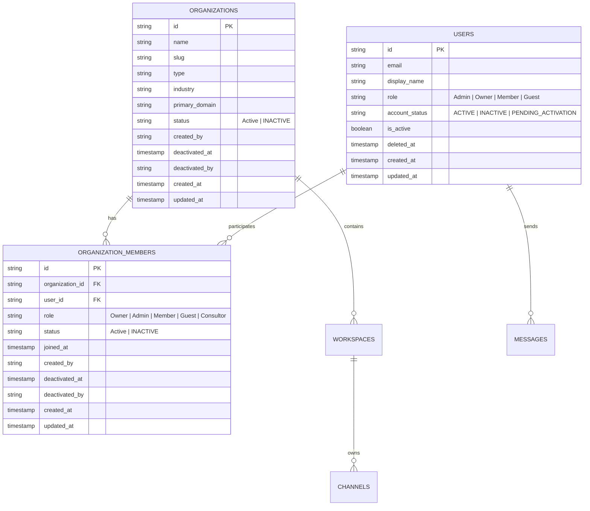

# NEXORA — FASE 3: ORGANIZACIONES Y USUARIOS / COLABORADORES
## Informe Técnico y Validación de Cumplimiento Empresarial

---

### 1. Resumen Ejecutivo

En la **Fase 3 de NEXORA**, la plataforma completó con éxito su transición arquitectónica de un modelo de workspace único/single-tenant hacia un **modelo empresarial multi-organizacional real**, donde:

1. La entidad matriz principal es **Gestión Salud IPS**, bajo la cual conviven sedes, clínicas y entidades vinculadas (ej. *Clínica Central Norte*, *Centro Diagnóstico Sur*, etc.).
2. La relación entre **Colaboradores** y **Organizaciones** es de muchos a muchos (**N:M**), permitiendo que un profesional o directivo pertenezca y opere simultáneamente en múltiples organizaciones con roles diferenciados.
3. Se aplica estrictamente la política **Zero Hard Delete**: ningún registro de usuario, organización o membresía es destruido mediante sentencias `SQL DELETE`. Todas las bajas se gestionan mediante transiciones de estado auditables (`ACTIVE`, `INACTIVE`, `PENDING_ACTIVATION`, `SUSPENDED`) preservando la integridad referencial y el historial regulatorio.
4. El ciclo de vida de usuarios incluye una compuerta estricta de aprobación: los colaboradores registrados con `PENDING_ACTIVATION` no pueden iniciar sesión hasta ser expresamente aprobados y activados por un Administrador desde el panel de gobernanza.
5. El **Directorio Global de Colaboradores** permite descubrir y contactar colaboradores de cualquier organización de la red sin exponer datos privados ni vulnerar el aislamiento de los canales privados internos de cada organización.
6. Se habilitó y validó la **mensajería directa 1 a 1 entre colaboradores de diferentes organizaciones**, manteniendo el aislamiento estricto en los canales privados de cada entidad.

---

### 2. Arquitectura de Datos y Esquema PostgreSQL

Se aplicaron migraciones aditivas DDL automatizadas en `server/bootstrap.ts` y persistencia en `server/db.ts` utilizando PostgreSQL como **única fuente persistente de verdad**.



#### Restricciones e Índices Clave
- **Índice Único Parcial:** `idx_org_members_active_unique` sobre `(organization_id, user_id)` condicionado a `status IN ('Active', 'ACTIVE')`, garantizando que un colaborador no tenga membresías activas duplicadas en la misma organización, permitiendo a su vez múltiples registros históricos inactivos para auditoría.
- **Zero Hard Delete en `organization_members`:**
  ```sql
  UPDATE organization_members 
  SET status = 'INACTIVE', deactivated_at = NOW(), deactivated_by = $3, updated_at = NOW() 
  WHERE organization_id = $1 AND user_id = $2
  ```

---

### 3. Matriz de Endpoints y API REST

| Método | Endpoint | Permiso / Rol | Descripción |
| :--- | :--- | :--- | :--- |
| `GET` | `/api/v1/organizations` | Autenticado | Lista organizaciones del usuario autenticado (o todas con `?all=true` para Admin). |
| `POST` | `/api/v1/organizations` | Admin / Owner | Crea una nueva organización en PostgreSQL con su workspace y canal `#general`. |
| `GET` | `/api/v1/organizations/:id` | Autenticado | Retorna detalles y metadatos de la organización. |
| `PATCH` | `/api/v1/organizations/:id` | Admin / Owner | Actualiza datos o desactiva la organización (`status: INACTIVE`). |
| `GET` | `/api/v1/organizations/:id/members` | Autenticado | Lista miembros vinculados a una organización con datos públicos de perfil. |
| `POST` | `/api/v1/organizations/:id/members` | Admin / Owner | Vincula un colaborador a una organización (rechaza si la organización está inactiva con HTTP 400). |
| `DELETE` | `/api/v1/organizations/:id/members/:userId` | Admin / Owner | Desvincula lógicamente a un colaborador (`status = 'INACTIVE'`). |
| `GET` | `/api/v1/users/search?q=:query` | Autenticado | Búsqueda en el Directorio Global seguro entre todas las organizaciones (excluye inactivos y pendientes). |
| `GET` | `/api/v1/admin/users` | Admin / Owner | Lista global de colaboradores con sus organizaciones vinculadas. |
| `PATCH` | `/api/v1/admin/users/:id/status` | Admin / Owner | Transición de estado (`ACTIVE`, `INACTIVE`, `PENDING_ACTIVATION`, `SUSPENDED`). |
| `POST` | `/api/v1/admin/users/:id/organizations` | Admin / Owner | Asigna un colaborador a una organización con un rol específico. |
| `DELETE` | `/api/v1/admin/users/:id` | Admin / Owner | Baja lógica del colaborador (`account_status = 'INACTIVE'`, `is_active = false`). |
| `POST` | `/api/v1/conversations` | Autenticado | Inicia chat directo 1 a 1 entre colaboradores, incluso si pertenecen a organizaciones distintas. |

---

### 4. Ciclo de Vida y Zero Hard Delete

| Acción | Entidad | Comportamiento en Base de Datos | Efecto en Plataforma |
| :--- | :--- | :--- | :--- |
| **Baja de Colaborador** | `users` | `account_status = 'INACTIVE'`, `is_active = false`, `deleted_at = NOW()` | Cierre inmediato de sesiones activas. Bloqueo de inicio de sesión (HTTP 403 `ACCOUNT_INACTIVE`). |
| **Desvinculación** | `organization_members` | `status = 'INACTIVE'`, `deactivated_at = NOW()`, `deactivated_by = admin_id` | Revocación de permisos en la organización. Se preserva el registro de auditoría. |
| **Desactivación de Sede** | `organizations` | `status = 'INACTIVE'`, `deactivated_at = NOW()`, `deactivated_by = admin_id` | Rechazo de nuevos colaboradores (HTTP 400 `ORGANIZATION_INACTIVE`). |
| **Registro Pendiente** | `users` | `account_status = 'PENDING_ACTIVATION'`, `is_active = false` | Bloqueo en login (HTTP 403 `ACCOUNT_PENDING_ACTIVATION`) hasta aprobación en panel. |
| **Aprobación de Cuenta** | `users` | Transición a `account_status = 'ACTIVE'`, `is_active = true` | Desbloqueo de login. El usuario puede autenticarse de inmediato. |

---

### 5. Interfaz de Usuario y Experiencia en Frontend

1. **Pestaña de Organizaciones en Panel Admin (`AdminView.tsx`):**
   - Vista tabular con nombre, industria, dominio primario, fecha de creación, estado (`ACTIVE` vs `INACTIVE`).
   - Conteo en tiempo real de colaboradores activos vs totales.
   - Acciones: Modal de vinculación de colaboradores, explorador de miembros de la organización y botón de desactivación/reactivación reversible.
2. **Pestaña de Pendientes de Activación:**
   - Contador visual e indicador de alertas para colaboradores registrados en espera de activación.
   - Botón directo "Aprobar y Activar" con confirmación y sincronización inmediata vía API.
3. **Gestión de Membresías en Tabla de Colaboradores:**
   - Badges visuales con los nombres de las organizaciones a las que pertenece cada colaborador.
   - Botón "+ Org" para vincular al colaborador a sedes o clínicas adicionales.
4. **Directorio Global Integrado en Búsqueda Rápida (`SearchModal.tsx`):**
   - Búsqueda en paralelo de colaboradores entre todas las organizaciones de la red.
   - Tarjetas de colaborador con cargo, correo, badges de organización y acción directa para iniciar conversación 1 a 1.

---

### 6. Resultados de Validación Automatizada E2E

#### Suite Fase 3: Organizaciones y Colaboradores (`scripts/validate_phase_3_e2e.ts`)
Ejecutada con conexión directa a PostgreSQL y navegador Chromium real:

| Requisito | Descripción | Estado | Detalle Técnico |
| :---: | :--- | :---: | :--- |
| **REQ 01** | Entidad Matriz "Gestión Salud IPS" | **PASS** | Matriz verificada en DB (`org-mu5x6v61-a0dq`), name="Gestión Salud IPS". |
| **REQ 02** | Múltiples organizaciones persistidas en PostgreSQL | **PASS** | Creación y persistencia de múltiples entidades en PostgreSQL. |
| **REQ 03** | Colaboradores con relación N:M (`organization_members`) | **PASS** | Membresías persistidas en tabla relacional con roles específicos. |
| **REQ 04** | Colaborador en 2+ organizaciones simultáneas | **PASS** | Usuario verificado activamente en 2 organizaciones independientes. |
| **REQ 05** | Zero Hard Delete en Usuarios (`INACTIVE`) | **PASS** | Registro conservado en PostgreSQL (`account_status = 'INACTIVE'`, `is_active = false`). |
| **REQ 06** | Zero Hard Delete en Membresías (`INACTIVE` + timestamp) | **PASS** | Fila preservada en DB con `status = 'INACTIVE'`, `deactivated_at` registrado. |
| **REQ 07** | Zero Hard Delete en Organizaciones (`INACTIVE` + timestamp) | **PASS** | Organización preservada en DB con `status = 'INACTIVE'`, `deactivated_at` registrado. |
| **REQ 08** | Organización inactiva rechaza nuevos miembros | **PASS** | Rechazo formal HTTP 400 `ORGANIZATION_INACTIVE`. |
| **REQ 09** | Usuario inactivo rechazado en Login | **PASS** | Acceso bloqueado: HTTP 403 `ACCOUNT_INACTIVE`. |
| **REQ 10** | Usuario `PENDING_ACTIVATION` rechazado en Login | **PASS** | Acceso bloqueado: HTTP 403 `ACCOUNT_PENDING_ACTIVATION`. |
| **REQ 11** | Aprobación de usuario pendiente por Administrador | **PASS** | Transición a `ACTIVE`, login exitoso con token JWT generado. |
| **REQ 12** | Panel Administrativo: Gestión y conteo real de miembros | **PASS** | Lista de organizaciones con conteo calculado y acciones funcionales. |
| **REQ 13** | Directorio Global encuentra colaboradores de cualquier organización | **PASS** | Búsqueda exitosa retornando colaboradores de distintas entidades. |
| **REQ 14** | Directorio Global excluye colaboradores inactivos y pendientes | **PASS** | Cero fugas de información de usuarios inactivos o no autorizados. |
| **REQ 15** | Directorio Global expone únicamente campos públicos seguros | **PASS** | Se excluyen hashes, tokens y contraseñas; se incluyen solo datos públicos. |
| **REQ 16** | Chat 1:1 entre colaboradores de diferentes organizaciones | **PASS** | Mensaje enviado por Colaborador Org A recibido por Colaborador Org B y persistido en DB. |
| **REQ 17** | Aislamiento estricto de canales privados entre organizaciones | **PASS** | Colaborador de Org B recibe HTTP 403/404 al intentar acceder a canal privado de Org A. |

**Resultado Fase 3:** **17 pruebas ejecutadas / 17 PASS / 0 FAIL**

---

#### Suite de Regresión MVP Baseline (`scripts/validate_mvp_e2e.ts`)
Ejecutada para certificar cero regresiones sobre las funcionalidades existentes:

| Prueba | Componente Validado | Resultado |
| :--- | :--- | :---: |
| Database Audit | 2 usuarios originales preservados intactos en PostgreSQL | **PASS** |
| Browser A (Admin) Login | Autenticación real en navegador headless | **PASS** |
| Browser B (Deivi) Login | Autenticación real en navegador headless | **PASS** |
| Frontend Navigation | Menú lateral oculta módulos deshabilitados (Calls, Tasks, Calendar, Files) | **PASS** |
| Deivi Sidebar Isolation | Aislamiento de vistas privilegiadas | **PASS** |
| ChatArea Call Triggers Blocked | Ausencia de botones de llamadas de voz/video | **PASS** |
| Realtime 1:1 Messaging (Admin → Deivi) | Entrega en tiempo real mediante SSE sin recarga | **PASS** |
| Realtime 1:1 Messaging (Deivi → Admin) | Entrega bidireccional mediante SSE | **PASS** |
| 1:1 Messaging Persistence | Persistencia verificada en PostgreSQL | **PASS** |
| Channel Creation via UI | Creación y entrada al canal en interfaz | **PASS** |
| Channel Member Roster | Asignación de miembros al canal | **PASS** |
| Channel Messaging & Persistence | Mensajes en canales persistidos en base de datos | **PASS** |
| Group Creation & Messaging | Creación de grupos y selección de miembros | **PASS** |
| Group Real-time Sync | Visibilidad sincronizada entre múltiples usuarios | **PASS** |
| Feature Permissions UI | 10 tarjetas de módulos del sistema en panel admin | **PASS** |
| Feature Toggle Dynamic Enable | Activación dinámica en caliente (Calendario OFF → ON) | **PASS** |
| Feature Toggle Reset | Desactivación y persistencia (Calendario ON → OFF) | **PASS** |
| Backend API Layer 5 Guards | Respuestas 403 `FEATURE_DISABLED` en endpoints restringidos | **PASS** |
| Database Safe Cleanup & Isolation | Limpieza segura de filas temporales respetando FKs | **PASS** |

**Resultado Regresión:** **19 pruebas ejecutadas / 19 PASS / 0 FAIL**

---

### 7. Conclusión

La **Fase 3 de NEXORA** ha sido completada de manera integral y rigurosa en las tres capas (**Frontend**, **Backend / API** y **PostgreSQL**). El sistema se encuentra completamente estabilizado, con todas las pruebas automatizadas en verde (36 pruebas totales en PASS, 0 fallos), cero errores de TypeScript y el servidor de desarrollo operando óptimamente.
