# Diagrama Entidad-Relación (ERD) — CollabPulse

Este documento detalla el modelo de datos relacional de la plataforma SaaS **CollabPulse** implementado sobre **PostgreSQL 18.4 (Google Cloud SQL)** y administrado mediante **Drizzle ORM / EF Core**.

## 1. Diagrama ERD Completo (Mermaid)

```mermaid
erDiagram
    TENANTS ||--o{ USERS : "posee"
    TENANTS ||--o{ WORKSPACES : "contiene"
    TENANTS ||--o{ ROLES : "define"
    TENANTS ||--o{ AUDIT_LOGS : "registra"
    TENANTS ||--o{ FILES : "almacena"
    TENANTS ||--o{ SUBSCRIPTIONS : "contrata"
    TENANTS ||--o{ INTEGRATIONS : "configura"

    USERS ||--o{ USER_ROLES : "asignado"
    ROLES ||--o{ USER_ROLES : "asigna"
    ROLES ||--o{ ROLE_PERMISSIONS : "otorga"
    PERMISSIONS ||--o{ ROLE_PERMISSIONS : "concede"

    USERS ||--o{ USER_SESSIONS : "inicia"
    USERS ||--o{ REFRESH_TOKENS : "mantiene"
    USERS ||--o{ NOTIFICATIONS : "recibe"
    USERS ||--o{ NOTIFICATION_PREFERENCES : "configura"
    USERS ||--o{ OAUTH_CONNECTIONS : "vincula"
    USERS ||--o{ API_KEYS : "genera"

    WORKSPACES ||--o{ WORKSPACE_MEMBERS : "incluye"
    USERS ||--o{ WORKSPACE_MEMBERS : "pertenece"
    ROLES ||--o{ WORKSPACE_MEMBERS : "rol_en_workspace"
    WORKSPACES ||--o{ WORKSPACE_INVITATIONS : "emite"
    WORKSPACES ||--o{ CHANNELS : "organiza"
    WORKSPACES ||--o{ CONVERSATIONS : "alberga"
    WORKSPACES ||--o{ TASKS : "gestiona"
    WORKSPACES ||--o{ CALENDAR_EVENTS : "agenda"
    WORKSPACES ||--o{ MEETINGS : "programa"
    WORKSPACES ||--o{ WEBHOOKS : "dispara"

    CHANNELS ||--o{ CHANNEL_MEMBERS : "suscribe"
    USERS ||--o{ CHANNEL_MEMBERS : "participa"

    CONVERSATIONS ||--o{ CONVERSATION_MEMBERS : "conecta"
    USERS ||--o{ CONVERSATION_MEMBERS : "conversa"

    CHANNELS ||--o{ MESSAGES : "recibe_en_canal"
    CONVERSATIONS ||--o{ MESSAGES : "recibe_en_directo"
    USERS ||--o{ MESSAGES : "envia"
    MESSAGES ||--o{ MESSAGES : "hilo_padre"

    MESSAGES ||--o{ MESSAGE_REACTIONS : "recibe"
    USERS ||--o{ MESSAGE_REACTIONS : "reacciona"

    MESSAGES ||--o{ MESSAGE_READS : "confirmacion"
    USERS ||--o{ MESSAGE_READS : "lee"

    MESSAGES ||--o{ MESSAGE_PINS : "fija"
    MESSAGES ||--o{ MESSAGE_ATTACHMENTS : "adjunta"
    FILES ||--o{ MESSAGE_ATTACHMENTS : "archivo_adjunto"

    TASKS ||--o{ TASK_COMMENTS : "comenta"
    USERS ||--o{ TASK_COMMENTS : "autor"
    TASKS ||--o{ TASK_ATTACHMENTS : "evidencia"
    FILES ||--o{ TASK_ATTACHMENTS : "archivo_tarea"

    CALENDAR_EVENTS ||--o{ CALENDAR_EVENT_ATTENDEES : "asiste"
    USERS ||--o{ CALENDAR_EVENT_ATTENDEES : "invitado"
    MEETINGS ||--o{ CALENDAR_EVENTS : "enlace_reunion"

    MEETINGS ||--o{ MEETING_PARTICIPANTS : "registra_asistencia"
    USERS ||--o{ MEETING_PARTICIPANTS : "participa_reunion"

    SUBSCRIPTION_PLANS ||--o{ SUBSCRIPTIONS : "aplica_a"
    SUBSCRIPTIONS ||--o{ SUBSCRIPTION_ITEMS : "detalla"
    SUBSCRIPTIONS ||--o{ INVOICES : "factura"
    INVOICES ||--o{ PAYMENTS : "cobra"
```

---

## 2. Mapa Detallado de Cardinalidades y Claves

| Tabla Origen | Cardinalidad | Tabla Destino | Clave Foránea | Política de Eliminación |
| :--- | :---: | :--- | :--- | :--- |
| `tenants` | 1 : N | `users` | `users.tenant_id` | `RESTRICT` |
| `tenants` | 1 : N | `workspaces` | `workspaces.tenant_id` | `RESTRICT` |
| `workspaces` | 1 : N | `channels` | `channels.workspace_id` | `CASCADE` |
| `channels` | 1 : N | `messages` | `messages.channel_id` | `CASCADE` |
| `conversations` | 1 : N | `messages` | `messages.conversation_id` | `CASCADE` |
| `users` | 1 : N | `messages` | `messages.sender_id` | `RESTRICT` |
| `messages` | 1 : N | `messages` | `messages.parent_message_id` | `CASCADE` (Hilo anidado) |
| `messages` | 1 : N | `message_reactions` | `message_reactions.message_id`| `CASCADE` |
| `messages` | 1 : N | `message_attachments`| `message_attachments.message_id`| `CASCADE` |
| `files` | 1 : N | `message_attachments`| `message_attachments.file_id` | `RESTRICT` |
| `workspaces` | 1 : N | `tasks` | `tasks.workspace_id` | `CASCADE` |
| `tasks` | 1 : N | `task_comments` | `task_comments.task_id` | `CASCADE` |
| `tasks` | 1 : N | `task_attachments` | `task_attachments.task_id` | `CASCADE` |
| `tenants` | 1 : N | `audit_logs` | `audit_logs.tenant_id` | `CASCADE` |
| `tenants` | 1 : N | `subscriptions` | `subscriptions.tenant_id` | `RESTRICT` |
